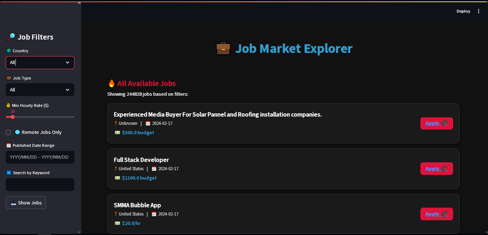

# Job Market Analysis and Recommendation System

## 📊 Project Overview

A comprehensive data analytics platform that analyzes job market trends and provides personalized job recommendations using real-time job posting data. The system helps job seekers identify high-demand roles, salary trends, and emerging opportunities.

## 🎯 Objectives

- Analyze correlation between job title keywords and salaries
- Identify emerging job categories and high-demand roles
- Compare salary trends across different countries
- Provide personalized job recommendations
- Track job market dynamics and predict future trends

## 🚀 Features

### 1. **Data Analysis & Insights**
- Keyword-salary correlation analysis
- Emerging job category identification
- High-demand role prediction
- Country-wise salary comparison
- Remote work trend analysis

### 2. **Recommendation Engine**
- Content-based job recommendations
- Skill and title-based matching
- Geographic and salary filtering
- Similar job suggestions

### 3. **Interactive Dashboard**
- Real-time market trends
- Salary distribution visualizations
- Growth opportunity identification
- Customizable search filters



## 🛠️ Technology Stack

### Backend & Analytics
- **Python 3.9**
- **Pandas & NumPy** - Data manipulation
- **Scikit-learn** - Machine learning models
- **NLTK** - Natural language processing

### Visualization
- **Matplotlib & Seaborn** - Static visualizations
- **Plotly** - Interactive charts
- **Streamlit** - Web application framework


### Local Development

1. **Clone the repository**
```bash
   git clone https://github.com/tayade-aniket/job_market_analysis_NHIS
   cd job-market-analysis_NHIS
```

2.	Install dependencies
```bash
   pip install -r requirements.txt
```

3.	Run the Streamlit app
```bash
streamlit run streamlit_app.py
```